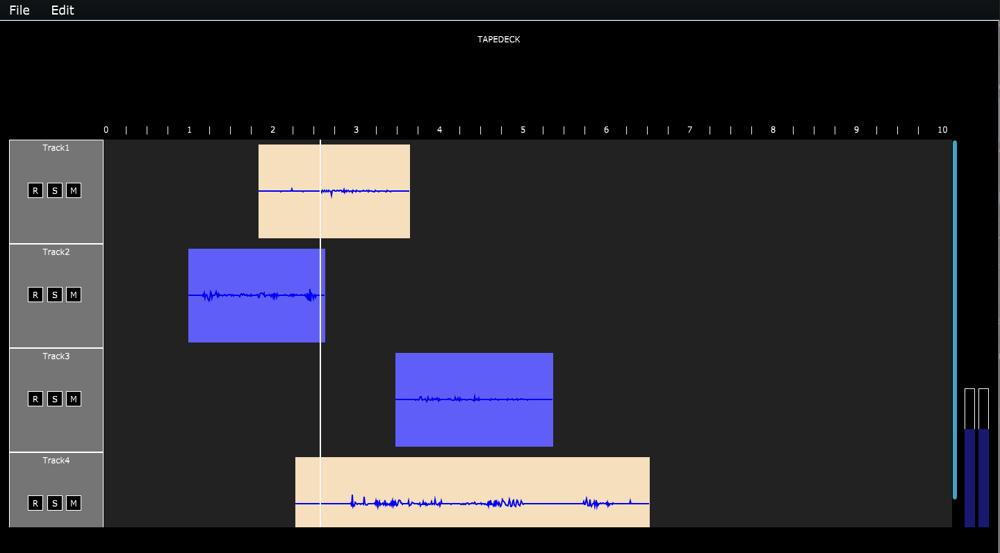

# TAPEDECK

Tapedeck is a fully terminal-based multi-track audio recording and playback application.

## Setup

Run `make tapedeck` to compile, and launch by running the newly-created executable `tapedeck`. 
